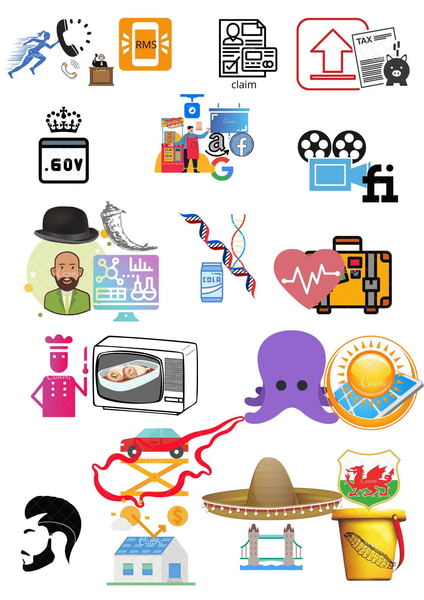
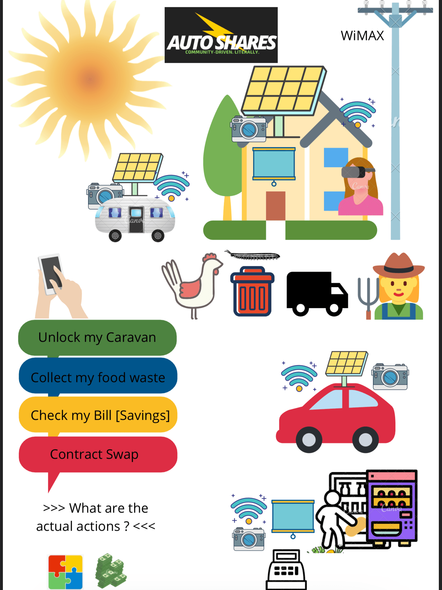

Still working out the exact format for this but it will include:
* The 'Comics' as I envisioned them at the time
* An updated version to reflect ones that were completed (tick) or removed (no longer necessary)
* Some reference or indication of the amount of time everything took (to get better at predicting)

But my gut tells me that the volume/significance of what we achieve (in a post-information age) is more limited by the ability to visualise what we truly want, more so than seeking time-based 'Agile' optimisations (although, of course, there are productivity ceilings that might need to be overcome e.g. by hiring more sales people).

## Month 

### Jan-Feb 2020: Pre-

### Jan-Feb 2020: Post-

***

## Quarter

### May Aug Nov

*** 

## Year

### 2021

***

## Decade 

***

## Streets Ahead

Life in Weeks Glitch applet to condense information space