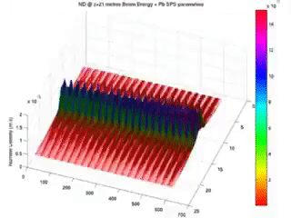
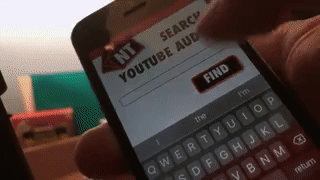

## What is this Nikipedia thing anyway?

The foundation of communication involves making assumptions about what other people know. I assume you can read English, or have access to a browser-extension that can translate this page for you. My main point is that 'knowledge clouds' exist between us, and in order for us to make  significant scientific progress in the future we will need to communicate more efficiently. The only other options are increasing the lifespan in which to make progress, or increasing the 'information bandwidth' in which to achieve. This 'personal knowledge cloud' is the low-tech solution for my half of the communication problem. Although in essence I started it almost 30 years too late to become a 'real-time' reflection, Nikipedia is an ongoing repository of 'time-series data' that mirrors the path intellectual things I choose to explore / exploit.

***

Hi, My Name is Nick or Νικόλαος in Greek.
I wanted an easily-accessible place to share my projects and knowledge so I created this open source project.
The idea is this: 
- (Almost) every day I will write/think aloud/plan in a way that feels natural for me.
- Sometimes those writings will be worth 'refactoring' into their own document/project.
- I will polish / present those projects into something more coherent and reader-worthy here, on the first page.
- Finally, I will link between documents (html web pages) that I have personally generated in a wiki-like way --

-- to a) to serve as a firm foundation for my descendents to also build on top of (should I be so lucky!), and
b) to test my own understanding as I develop personal 'reference documentation'.
Continued maintenance of this project is also my personal fight against early-onset Alzheimer's, and it is likely one day some big data summaries could be extracted from the text files.

It is not enough to read and study; you must create and solve.

## Aims
I'm lucky. I got to grow up in the right environment, with the right family, and get the right education.
I spent my entire waking life orientatied towards one principle, in the same way Chris Hadfield chose to eat is vegetables from age 6 because he believed it would make him more likely to become an astronaut(!) -- My principle was more of a 'feeling' and the feeling was to 'search' for the roots of what drives humanity forward - and then contribute to it.  

What I (and feasibly You, my future collaborators) have decided to work on:

- The Future of Energy and Pensions (Solar Club)
- The Future of Education (Tinkerbricks VR/AR)
- The Future of Pensions and Transport (Auto-Shares)
- The Future of Food and Waste Managment (BSFL)

And of course any other jobs/contracts/side projects/activities related to these Aims; they are holistic themes part of a bigger jigsaw puzzle -- therefore working to develop Customer Relationship Management software systems (which I have done), studying Physics to Masters' level, or gaining 2-3 years of employment in the AR hardware or VR Training industry, for example, are all necessary and relevant to enjoying the journey of achieving these Aims.

 <form style="border:1px solid #ccc;padding:3px;text-align:center;" action="https://tinyletter.com/nickth" method="post" target="popupwindow" onsubmit="window.open('https://tinyletter.com/nickth', 'popupwindow', 'scrollbars=yes,width=800,height=600');return true">
<label for="tlemail">Enter your email address</label>

<input type="text" style="width:140px" name="email" id="tlemail" />
<input type="hidden" value="1" name="embed"/><input type="submit" value="Subscribe" />
<a href="https://tinyletter.com" target="_blank">The Future of XYZ</a>
</form>
If you would like to reach out/keep in touch/collaborate with me on this 4-part quest, consider signing up with your best email address here. The choice of how and when to be serendipitous is entirely yours.

## Portfolio Projects (Semi-Chronological)

More links/gifs coming soon with concise explanations; this list is continuously being added to.

If, having skimmed through my Portfolio Projects below, you have any feedback (or even potential job offers),
the best (and fastest) place to probably reach me is Twitter. DMs are open :)
<a href="https://twitter.com/nicktheodorou?ref_src=twsrc%5Etfw" class="twitter-follow-button" data-show-count="false">Follow @nicktheodorou</a>

***

Lua - Scripts for programming Keithley Machines to measure POWER / I-V Curves of Dye Synthesized Solar Cells of any size by sweeping Current and Voltage

Mathematica - Managing Packages and a Notebook to visualise the efficiency of Dye Synthesized Solar Cells under fluorescent and outdoor light sources (Measuring the Shockley-Queisser limit) 

CLI / Unix Commands - Submitting Particle-in-Cell simulation jobs to UCL's Super Computing Cluster (HPC)

MATLAB - Solving Equations of Motion for a Double Pendulum; Creating Time Lapse visualisations of Proton-Driven Plasma Wakefields

Processing - Arduino-controlled Data Visualisation [In future I could run this type of project directly in a web environment]

Meteor.js - Setting up Telescope (a hacker news clone); Login with Twitter / Conference Attendee App

C++ - Use of Statistics libraries written by CERN to analyse example results data, Glen Cowan was my instructor

LAMP Stack - Data-Driven 140 Line Twitter Clone  
[Check it out here](http://tweetdemo.tinkerbricks.co/)

LaTeX - My _beautifully_ typeset Masters' Thesis on Plasma Wakefield Acceleration (Thanks Donald Knuth)
[Check it out here](https://www.amazon.co.uk/Beyond-Large-Hadron-Collider-Particle-ebook/dp/B076PXBTQ7)

Algorithmia - Trained AI that rotates Photos for 'Horizon-correction' written in Python  
[Check it out here](https://youtu.be/Gtc-aU-nG5g)

IBM Watson / Twilio - Telephony App that you phone to tell it your Symptoms and it responds with "medical Advice" ("Dr Watson")

Twilio / Zapier / Sheets - Send an email by typing a phone number in the Subject to receive a call that reads out the body text. ("Robo Caller" - purely for fun, not to spam).
To expand on this idea I used Yet Another Mail Merge and Google Sheets to generalise the Robo Caller's  abilities

Dialog Flow (api.ai) - Rough prototype of a Facebook Messenger chatbot designed to serve as your Personal Recruitment Consultant. Launched the idea on Product Hunt under the brand name Emissary [by Persona Ltd]. Pitched to Nathan Bowles CEO, Smart Recruitment

Twilio - Setup a Toll-free number that routes to an office landline for Smart Recruitment

Unity - Immersive VR world with Animations and Teleportation, compatible with a range of headsets and WebVR 

Sketch / Principle - High-fidelity Mockups for a mobile-first YouTube Captions Search application. I then edited a 'vlog' style video documenting the process. FYI - the final half of this video covers an unrelated project (called Auto-Shares)   
[Check it out here - x1.75 playback speed advised](https://www.youtube.com/watch?v=yM6DIXmob8A&feature=youtu.be)

Progressive Web Apps - Deployment of the _beautiful_ sample Books search app, idea is to swap out the Google Books API for Youtube Video results using Audio Transcription Microservice + a TFIDF algorithm written in Python

Glide - Ported a collection public domain audio files into a step-by-step language learning course (App-based), includes a chat feature to find fellow students to practise with, and a [dummy] directory of local 1-to-1 language tutors. Also works as a Chrome App.  
[Check it out here](https://wthwy.glideapp.io/)

Ethereum / Solidity / Metamask - Deployed my own smart contract to the Test Network to prototype an idea using my own Tokens

Typeform / Zapier / Trello - Built a JustEat-style menu and order tracking system for my Dad's restaurant

Typeform Zapier Trello + Stripe + AdWords - Used a similar 'Stack' to the JustEat-clone and prototyped a new startup idea in 4 days to test business viability and Unit Economics. Started generating sales.

Xcode / Unity - Experimented with Apple's newly released AR Kit to create an iOS app that demonstrates Augmented Reality

<iframe width="560" height="315" src="https://www.youtube.com/embed/YpGqMYtjz8M" frameborder="0" allow="accelerometer; autoplay; encrypted-media; gyroscope; picture-in-picture" allowfullscreen></iframe>

***

Everything you see above is work strictly engineered by me (solely), anything below is from a team project where I have served as a Product Manager / Project Manager:

<iframe width="560" height="315" src="https://www.youtube.com/embed/2SUyHcx_PJ4" frameborder="0" allow="accelerometer; autoplay; encrypted-media; gyroscope; picture-in-picture" allowfullscreen></iframe>

 
 

<iframe width="560" height="315" src="https://www.youtube.com/embed/d_M9h4Ndxts" frameborder="0" allow="accelerometer; autoplay; encrypted-media; gyroscope; picture-in-picture" allowfullscreen></iframe>

