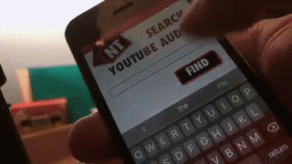
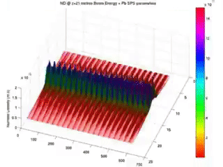

[My under developed ideas for solving the Yang-Mills Mass Gap Problem](./yang.md)

***


[Link to Past](./past_projects.md).[Link to Future](./future_projects.html). 

My idea here is to Record myself reading this to Descrypt, then to autogenerate future 'episodes' and publish them to YouTube and Anchor (with a couple relevant pictures if video - perhaps an AI generated representation)

The next step would be to pick out the best free literary works of Project Gutenberg,
(I think erotica would be a viral niche for the Ellies of this world(!),
Add some example sponsorship space; test out some different formats like reverse sponsorship,
Market it on places like Flo; also other niche YouTubers
Include the Invidious links and SLIENTLY (i.e. in the Video but not spoke) mention how to use this.
Publish a new story every night for different Timezones and languages (if Descrypt supports that) - a set 20min format.
Rake it in, Collect and Grow.
* * *

## Verbose Portfolio Projects

This is a Chronological account of my experience gained with various technologies.

I wrote my first bit of HTML during University to host my Academic work; I got introduced to this world pretty late in the day - although I do vaguely remember programming the turtle in Logo on an Acorn computer as a 4yr old(!) it would be my first and last chance of gain exposure to true Computing during my school years. A subset of Millennials growing up in the UK did become very proficient at MS Office during this time however..

Next up was a crash course on MATLAB and a self-guided course on Mathematica that counted as one-half of a Labs module. The structure was a 'rote learning' style with one unseen stumper at the end - I was nearly always the last to leave the Labs, but was diligent about getting through it there and then (I had no appropiate equipment to continue on at home, during that point my laptop was an early beast borrowed from the Dyslexia department).

The final project was to simulate a Double Pendulum in MATLAB to solve their Linear Equations of motion - it took me 17hrs total, of which I sat on my girlfriend's sofa for 8hrs straight (using her laptop). I crawled into bed at 4AM; that was tough!

In yr 3 avoided a module on OO Programming in Java because I didn't want it to bring my average down. I kind of regret not beeing put in the pressure zone to learn the fundamentals at a compressed rate - but the braver souls that did really did suffer! Besides, I would have missed out on the Physics of the Earth module which was taught by a fellow Cypriot (and was incredible). Gravitatonal corrections and lava as magnetic tape - one memorable anaecdote I devised is that in the final exam for 10 Marks (so basically 10 minutes), we had to prove what it took Newton 10 Years to come out with. Yeah, Yeah, I know he had to first invent Calculus and then retrospectively re-prove it just using Geometry to make sure it became accepted by the community, but still!

Fortunately though during the Summer I managed to weasel my way into the Institute of Physic's inaugural Top 40 work experience programme. I would say only then the penny was starting to drop. If I'm honest just being able to read code and follow the very basic logic flow. I was programming some heavy duty hardware called Keithley's to measure Power Curves of some special [Dye Synthesised] Solar cells. I was comparing against Lab results from Logitech who were the customer. Lua Scripts were the weapons of choice. For another assignment I just ran a Mathematica notebook - but having input original data from the special solar cells, we interpolated the discovery of a very original result. Perhaps it was worthy of publishing - but this was a commercial operation, thus all propietary. Nquist plots and Electrochemical Impedance Microscopy were a step well beyond me however (I wasn't joke about the weaseling in, this was the reason no one else dared to apply for the position!)

During that summer I was also supposed to learn FORTRAN and gave it a good go, but without aiming towards an actual pet project I just ended up reading a very dry text book and not being able to apply that knowledge practically ahead of what I had really been gearing up 3yrs of study towards: PROTON - PLASMA SIMULATIONS.  

So I did that. I remember spending 4hrs narrowing down the 80 available projects to my shortlist of just 3 - again whilst sat on my girlfriend's sofa..but this time in her flat in Paris..while she was awake..and while we were supposed to be visiting that Tower thingy before it shut. That's how much I cared about getting to do cool sh#t in Science and Technology, still do.

I would have paid in Blood (perhaps not _actual_ organs) to simply be involved with all threee. Heck all 80. But although I have dedicated the largest part of my attention to honing in on Commerical applications just at the point they are ready come out of the lab (Dr Neil Skipper one of the 3 options had done exactly this the year before with Single Walled Nanotubes and licencing his method to Linde Group), I believed that the biggest FOMO would arise from me not taking a High-Performance Computing Simulation project during the last point in my scientific career were it could be completely OK to FAIL. Heck, this wasn't a PhD. 

By failure I mean of the abject variety. You see I was buzzing from my Solar placement with all the confidence in the world - I had DONE it. But could I _really_ do it. It was a case of being at the exact inflection point in the Duning-Kuringer effect or as what Donald "Rummy" Rummsfield would categorise as Known Unknowns vs Unknown Unknowns. God I love the fact he came out with that quote as a diversion tactic to detract away from being scrutinised by the press - not because it was defiant, but because of its sheer brilliance that stunned everyone. You've got to watch the clip.

Anyway I did pick it up - I ran a unique Simulation on a Super Computing Cluster - my parameters were submitted to the job queue along with all the other researchers - I created incredible Time Lapse visualisations of the results in MATLAB. Sure, it didn't involve me lay any new bricks - but after much trial, help, and error, I got to climb the wall and be the very first to peer over and gaze at *something* using tools that much less than a year ago were all but completely unknown. I had only clocked that all computers came equipped with Terminal Client and Command Line Interfaces a couple days before starting my project because I had somehow been invited to audit a (very expensive) class at General Assembly in London.

I was well on my way...but it was at that year's Yahoo! Hack Europe where my eyes became really opened.


Stay Tuned for Part 2.


I know this has been Incredibly verbose but If you enjoyed listening to this thread of life experience just as much as I enjoyed writing it Give this a like and subscribe to let me know. 
And give it a big thumbs down if you thought I have been polluting the internet with drivel.


```
The final element.
```
