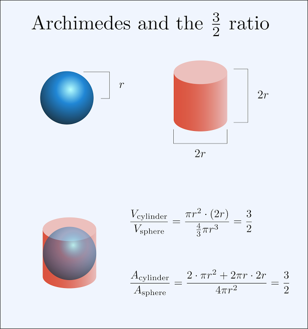
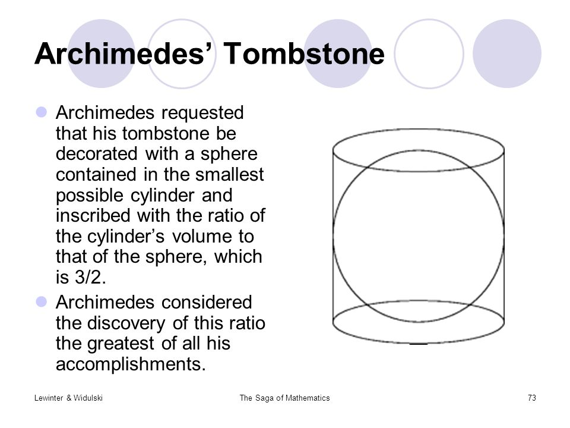

Some open source software out there completely rocks: OBS, Youtube-dl, Blender, {insert recommendations here e.g. Descript but not paid....can I setup a pipeline on Colab and Paperspace for free/cheap audio transcriptions?}

Once I became happy with the basic ability to setup OBS I started recording myself -- with the intention of creating 'content' that would help me retain knowledge and experiences, but for me to take it seriously / stay accountable I have to have a final 'objective'. All these unlisted YouTube videos are my output of that endeavour / rationale / thinking. The other reason for make this semi-public is personal speed efficiency accessibilty to the content i.e. I don't mind if people stumble on this, but I wouldn't expect them to stick with learning the exact same things that I am learning... indeed you must 'teach' yourself to retain 90%, write it down and you might retain 70%, listen to it and you'll retain 20%, read it and you'll retain 10%; it is more efficient to teach something in your own words in order to retain it.

[Daily Keeps](./daily_keeps.md).

### NHS STP Open day (Cancer Genomics)
_16th Jan 2019_

coming soon

<iframe width="560" height="315" src="https://www.youtube-nocookie.com/embed/ZvjtR8mRFvs" frameborder="0" allow="accelerometer; autoplay; encrypted-media; gyroscope; picture-in-picture" allowfullscreen></iframe>

### Summary of Plato's Republic

<iframe width="560" height="315" src="https://www.youtube-nocookie.com/embed/bI9y24PJXaw" frameborder="0" allow="accelerometer; autoplay; encrypted-media; gyroscope; picture-in-picture" allowfullscreen></iframe>

<iframe width="560" height="315" src="https://www.youtube-nocookie.com/embed/aoVDxb2saOY" frameborder="0" allow="accelerometer; autoplay; encrypted-media; gyroscope; picture-in-picture" allowfullscreen></iframe>

### Polya on how Archimedes invented Analytic Geometry
The relation between Areas and Volumes of Cylinders and Spheres was requested by Archimedes to be inscribed on his tombstone.
It wasn't a strict mathematical proof (something that Archimedes knew and made very clear) but it was a case of how Physics (and the formula for a cylinder which had just been discovered at the time) could be used to inform and infer the likely formula for the volume of a sphere (?).

I didn't upload this one to Youtube as it was a bit rough, but it will go here if I record it.

